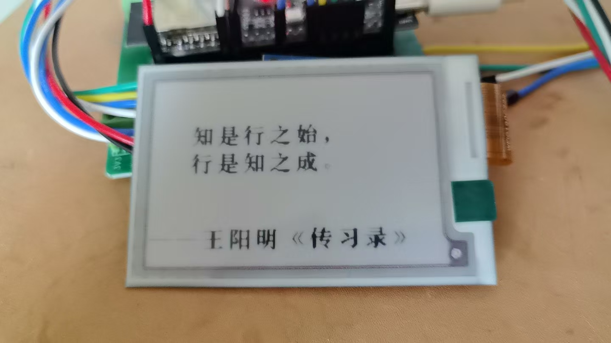
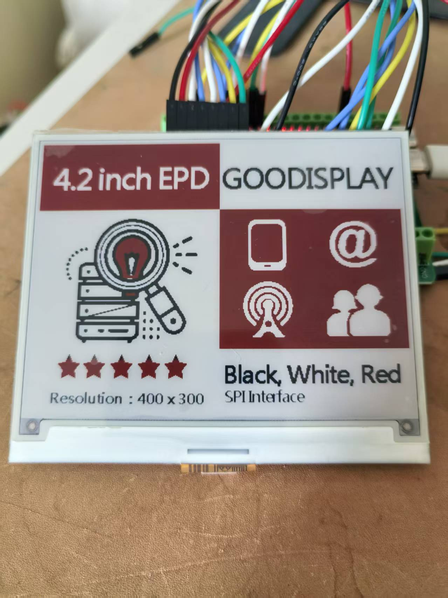

# InkWord-ESP32（墨读 InkRead）

基于 ESP32-S3 墨水屏的**全科记忆背诵机** —— 全栈 IoT 解决方案：固件（设备端）+ 后端 API + 管理后台 + Flutter 伴侣 App。

> 本文档是项目**现状快照**（2026-09-05 整理）。配合 `docs/ROADMAP.md`（版本路线图 v1.0→v2.0）、`docs/PRD_V2.1.md`（需求全集）与 `docs/WIRING_DIAGRAM.md`（接线全集）使用。

---

## 1. 项目状态快照（2026-09-05）

### 1.1 总体结论

**v1.1~v1.5 软件侧全量完成 + v2.0 账户首增量交付 + 架构大治理 + 多屏兼容 9 面板**：固件从 24 模块扩展至 **67 模块（134 文件）**，构建矩阵从 8 环境扩至 **12 环境（含 2 probe）**；后端从 39 测试扩至 **69+ 测试全绿**；新增 Flutter 伴侣 App（卡组编辑器 + UGC 发现 + 设备绑定）。

**定位升级**：设备从「英语单词学习机」升级为「**全科记忆背诵机**」——一切「看题面 → 回忆 → 揭晓 → 自评」的知识（单词 / 古诗文 / 公式 / 知识点）皆可承载；Subject/Deck/Item 三表泛化模型已落地，英语仅为科目之一。

### 1.2 版本交付进度

| 版本 | 状态 | 核心交付 |
|:---:|:---:|:---|
| v1.1 真机闭环版 | 🟡 软件完成，真机待硬件 | ES8311 音频播放链路验收 + 提示音 + NVS 扩容 + 深睡架构 |
| v1.2 学习体验版 | ✅ 软件完成 2026-08-24 | QUIZ 四选一（纯 C 核心 + native 测试）+ 每日计划 + 设置页 + 电量计 |
| v1.3 内容生态版 | ✅ 软件完成 2026-08-24 | 词书 Deck 化 + 学习分析云端 + AI prompt 科目参数化 + App 一期 |
| v1.4 全科地基版 | ✅ 软件完成 2026-08-24 | Subject/Deck/Item 三表泛化 + 卡组管理器 LR04 按组隔离 + 渲染分派 + 古诗文默写 + 字库子集下发 + 账户决策 ADR-001 |
| v1.5 全科体验版 | ✅ 软件完成 2026-08-25 | QUIZ P2（听音/2×2 快答/判断/配对）+ App 二期卡组编辑器 + AI 批量生成卡组 + 科目级配额/考试倒计时 |
| v2.0 平台化版 | 🟡 首增量交付 2026-08-25 | 轻账户（bind/unbind）+ UGC 分享（fork 深拷贝）+ **架构大治理**（页面路由栈化/main.cpp 拆分/面板家族化/NVS 权威表/LAN v2/黄金帧自检）|
| 最新（2026-09） | ✅ 持续交付 | 墨封印章系统 + 阅读模式增强（书架/书签/搜索/词链接）+ 后端 UoW 重构 + 书籍管理 + 多屏 bring-up（E042A13-BW/WF0270/GDEW027C44） |

### 1.3 四端构建/验证状态

| 端 | 构建命令 | 状态 | 最近验证 |
|:---|:---|:---:|:---|
| 固件（12 环境构建矩阵） | `pio run -e <env>` | ✅ | 2026-09-05（Flash ~78%；67 模块全量纳入） |
| 固件算法单测（host） | `pio test -e native-test` | ✅ 34/31+3skip | 2026-09-03（FSRS 对拍 + QUIZ 题型 + 每日计划 + 字库子集） |
| 后端 | `dotnet build` + `dotnet test` | ✅ 69+/69+ | 2026-09-05（UoW 重构 + 书籍管理 + AI 管线 + 账户/UGC） |
| 管理后台 | `ng build` | ✅ | 2026-08-25（AI 审核台/卡组生成弹窗/对比图表） |
| Flutter App | `flutter analyze` + `flutter test` | ✅ 22/22 | 2026-08-25（卡组编辑器 + deck_codec + UGC 发现 + 设备绑定） |

---

## 2. 实物照片

| 2.7 寸黑白红墨水屏（显示中文引文） | 4.2 寸 GOODISPLAY 黑白红墨水屏（400×300） |
|:---:|:---:|
|  |  |

---

## 3. 项目结构

```
InkWord-ESP32/
├── InkWord_Firmware/        # ESP32-S3 固件（Arduino + ESP-IDF 组件，67 模块 134 文件）
│   ├── src/                 #   源码（main.cpp + 各功能模块）
│   │   ├── panels/          #   多屏面板驱动（9 面板 + 共享总线）
│   │   ├── probe/           #   面板诊断探针（9 探针程序）
│   │   └── mp3/             #   libhelix MP3 解码器（源码内嵌）
│   ├── tools/               #   字库/图标/音频生成脚本
│   ├── partitions_default.csv
│   └── platformio.ini       #   12 构建环境（生产/演示/多屏/probe/native-test）
├── InkWord_Backend/         # 后端 API（.NET 8 五项目分层）
│   └── src/
│       ├── InkWord.API/         # 11 控制器 / DTO / 中间件 / Program.cs
│       ├── InkWord.Core/        # 13 实体 / 接口 / 公共类型
│       ├── InkWord.Infrastructure/  # EF Core DbContext / 仓储 / Redis 缓存
│       ├── InkWord.Services/    # 11 领域服务（SRS/FSRS/AI/ASR/TTS/Chat/Book/VoiceSearch…）
│       └── InkWord.Jobs/        # Hangfire 定时任务（AI 生成/TTS/ChatTurn/DeckGen）
├── InkWord_Admin/           # 管理后台（Angular 17 standalone + Material + ECharts）
│   └── src/app/modules/
│       ├── dashboard/           # 数据看板 + 今日学习分析
│       ├── word-management/     # 词库 CRUD + AI 审核台 + AI 卡组生成弹窗
│       ├── device-management/   # 设备管理 + 远程指令
│       ├── ota/                 # OTA 升级
│       └── wrongbook/           # 错词本
├── InkWord_App/             # Flutter 伴侣 App（iOS/Android）
│   └── lib/
│       ├── features/            # 六大功能页（home/deck/editor/compose/stats/device）
│       ├── services/            # BLE/mDNS/HTTP/Cloud 通信层
│       ├── state/               # 账户/设备状态控制器
│       └── core/                # EPD 帧协议
├── tools/                   # 跨端工具（FSRS 对拍向量 / 默认词库音频 / 板卡家族门禁 board_gate.py）
├── docs/                    # 设计文档（18 篇）
├── docker-compose.yml       # 全栈编排（postgres/redis/ollama/backend/frontend）
└── README.md                # 本文档
```

---

## 4. 系统架构

```
┌─────────────────────── ESP32-S3 N16R8（墨读设备）───────────────────────┐
│  多屏兼容 9 面板（panels/ 面板家族化 + probe/ 诊断探针）                   │
│  五向导航开关 + SET/RST 侧键 → button_handler / shortcut_map（六槽位）    │
│  学习模式（study_mode_machine）：闪卡/三选一/拼写/阅读/默写/浏览           │
│  测验引擎（quiz_session）：四选一/听音辨义/2×2快答/判断/配对 五题型        │
│  SRS 引擎（srs_engine，FSRS-4.5）+ LR04 按组隔离 NVS 学习状态            │
│  卡组管理器（deck_manager）：SD 多卡组 + manifest + 按组配额/考试倒计时     │
│  墨封系统（ui_stamp）：圆形印章单帧直显 + 已熟练标记过滤                   │
│  阅读器（reader_engine）：书架/书签/章节跳转/全文搜索/词链接               │
│  AI 对话（chat_mode）：五态状态机 + NDJSON 流式消费 + barge-in 打断       │
│  三级→四级点阵字库（16/20/24/32px）+ SD 子集级联（cjk_font_sd）           │
│  音频全链路：ES8311 CODEC（I2C+I2S）+ libhelix MP3 + mic_recorder 录音    │
│  Wi-Fi + SoftAP 配网 + LAN 直传 v2（8B 帧头）+ BLE 配网（待 coex 评估）  │
│  深睡架构（power_manager）+ OTA 双分区 + 黄金帧自检                      │
└──────────────┬──────────────────────────────────────────────┘
               │ HTTPS/JSON（X-Device-Key 认证）
               ▼
┌─────────────────────── InkWord_Backend（.NET 8）───────────────────────┐
│  设备 API：register / sync（增量词库+卡组）/ progress / heartbeat /       │
│           OTA / pronunciation / chat（含 NDJSON 流式）/ audio / abort    │
│  账户 API：register / login / me / devices（bind/unbind/aggregate）/     │
│           decks CRUD（api/me 轻账户，learner 角色）                      │
│  管理 API：auth（JWT）│ words/decks CRUD + CSV 导入 + AI 生成/审核 │     │
│           books 书籍管理 │ dashboard 统计 │ devices + 远程指令 │ OTA      │
│  AI 管线：AiContentService（kind 0~3）+ AsrService + TtsService +       │
│           ChatService + VoiceSearchService + FsrsService（双端对拍）     │
│  PostgreSQL 16（13 实体含 Subject/Deck/Book/ChatTurn/Account）+          │
│  Redis 7 + Hangfire（AI 夜间生成/TTS/ChatTurn 周报）+ Serilog + Polly   │
└──────────────┬──────────────────────────────────────────────┘
               │ REST/JSON（JWT Bearer / X-Device-Key）
               ▼
┌─────────────────────── InkWord_Admin（Angular 17）─────────────────────┐
│  数据看板（统计卡片 + ECharts 日活/SRS 分布/今日学习分析）                 │
│  词库管理（CRUD/CSV 11 列导入导出/AI 审核台/AI 卡组生成弹窗）             │
│  设备管理 │ OTA 升级 │ 错词本                                            │
│  三态主题（亮/暗/跟随系统）+ JWT 拦截器 + 错误拦截器                      │
└──────────────────────────────────────────────────────┘
               │
               ▼
┌─────────────────────── InkWord_App（Flutter）──────────────────────────┐
│  设备页（BLE/mDNS 发现 + AP/LAN 配网 + 账户绑定/解绑）                   │
│  词书页（列表切换 / 上传 / 卡组选择）                                    │
│  卡组编辑器（登录注册 / 新建科目×版式 / 条目 CRUD / CSV 导入 / LAN 推送） │
│  发现页（UGC 卡组搜索/分页/一键导入）                                    │
│  统计页（今日统计 / 连续天数可视化）                                      │
│  deck_codec（RFC 4180 CSV ↔ words.json 设备契约状态机）                  │
└──────────────────────────────────────────────────────┘
```

---

## 5. 技术栈

### 5.1 固件（`InkWord_Firmware/`）
- **芯片**: ESP32-S3 N16R8（16MB Flash + 8MB Octal PSRAM；Arduino 框架 + ESP-IDF 组件，PlatformIO espressif32@7.0.1）
- **多屏兼容 10 面板**（panels/）：DEPG0370 UC8253（默认）/ E042A13 SSD1619 / E042A13-BW / WF0270 SSD1680 / GDEW027C44 IL91874 / OPM021EB / WFT0290 UC8151D / GDEQ031T10 3.1" UC8253 / HINK-E0213A31 SSD1680 + 共享总线 epd_bus；UC8253 族 ops 宏合用 + desc 契约校验器防护
- **内存布局**（8MB PSRAM）: 词池 4000 词×1096B ＋ 词库 JSON 缓冲 2MB ＋ 阅读器书文件 ≤4MB ＋ 学习状态 LR04 按组隔离
- **字体**: FreeSans（ASCII）+ 四级点阵中文字库 16/20/24/32px（3892+ 字，Kaiti SC Bold 回退链）+ SD 子集级联（cjk_font_sd，古诗生僻字按需装载）
- **存储**: NVS（LR04 sparse 按组隔离 21B/词、5s 延迟落盘）+ SD 卡 SPI+FAT（书籍/音频/词库/字库子集）
- **音频**: ES8311+NS4150B CODEC（I2C 38/39 + I2S 4/5/6/11）+ libhelix MP3 源码内嵌异步播放 + mic_recorder 全双工录音（3s 跟读/10s 对话）+ 音量 0~100 三入口
- **网络**: Wi-Fi STA + SoftAP 配网 + LAN 直传 v2（8B 帧头 + device-info）+ HTTP 同步 + OTA 双分区 + BLE 配网（待 coex 评估）
- **构建矩阵 13 环境**：inkword-s3（生产）/ demo / e042 / e042bw / wf0270 / gdew027c44 / gdeq031t10 / wft0290 / opm021eb / hink213 / gdeq031t10-probe / opm021eb-probe / native-test（另 bs-check/串口诊断）；黄金帧回归基线已启用（HINK 首屏 3 页入库）

### 5.2 后端（`InkWord_Backend/`）
- .NET 8 WebAPI（5 项目分层 + Unit of Work 模式 + Polly 重试策略）+ EF Core 8（EnsureCreated 自动建表 + 幂等 SQL 迁移）
- PostgreSQL 16（13 实体：Word/Subject/Deck/Book/Account/ChatTurn/ChatReview/ReadingProgress/DeviceBookmark 等）
- Redis 7 + Hangfire（AI 夜间批量/TTS 合成/ChatTurn 周报/DeckGen 占位行）+ Serilog
- JWT Bearer（PBKDF2 + 管理端 Admin/Operator/learner 三角色分流）+ 设备 ApiKey（`X-Device-Key`）
- AI 管线：AiContentService（kind 0~3：例句/词根/辨析/卡组）+ AsrService（zipformer 双语）+ TtsService（Piper）+ ChatService（NDJSON 流式 + abort + 摘要压缩）+ VoiceSearchService + FsrsService（双端对拍）
- CSV 词库导入 11 列 + 协议 v2 双写（Subject/Deck/Item 泛化，旧固件忽略新字段向下兼容）

### 5.3 管理后台（`InkWord_Admin/`）
- Angular 17（standalone components）+ Angular Material（三态主题）+ ECharts
- AI 审核台（kind 0~3 四类建议 diff 比对）+ AI 卡组生成弹窗（科目×版式×素材）+ 看板今日学习分析条
- JWT 拦截器 + 全局错误拦截器 + Lazy-load 路由

### 5.4 Flutter App（`InkWord_App/`）
- Flutter + Provider 状态管理 + flutter_blue_plus（BLE）+ multicast_dns（mDNS 发现）
- 卡组编辑器（三页：editor/detail/item_sheet）+ deck_codec（RFC 4180 CSV ↔ words.json 状态机）
- 账户体系（CloudClient + AccountController 静默校验）+ UGC 发现页 + 设备绑定
- EPD 帧协议 + LAN 直传 + BLE 双侧架构

---

## 6. 固件模块清单（`src/` 67 模块）

### 6.1 核心学习与记忆
| 模块 | 职责 | 状态 |
|:---|:---|:---:|
| main.cpp | 应用骨架/词池 PSRAM/词卡 UI/渲染分派/同步恢复 | ✅ |
| study_mode_machine | 六学习模式状态机（闪卡/三选一/拼写/阅读/默写/浏览） | ✅ |
| srs_engine | FSRS-4.5 间隔重复（双端对拍全绿） | ✅ |
| learning_state | LR04 按组隔离 NVS（21B/词、5s 延迟落盘、deck 维度） | ✅ |
| word_parser / word_loader | 词库 JSON 解析（WordEntry 11 字段 + 协议 v2 新字段忽略兼容） | ✅ |
| deck_manager | 卡组管理器（SD manifest 扫描/活跃切换/LR04 按组隔离/科目配额） | ✅ |
| daily_plan | 每日学习计划（按组配额/考试倒计时/due_horizon 放宽） | ✅ |
| quiz_session / quiz_ui | 测验引擎（五题型：四选一/听音/2×2/判断/配对 + 轮换注入） | ✅ |
| review_ui | 复习词表滚动与自评出队 | ✅ |
| browse_mode | 浏览模式（教材目录/语音查词） | ✅ |

### 6.2 阅读与内容
| 模块 | 职责 | 状态 |
|:---|:---|:---:|
| reader_engine | TXT 电子书分页引擎（变宽排版/页表/进度记忆） | ✅ |
| book_shelf / bookmark_mgr | 书架管理 / 书签管理 | ✅ |
| reader_search / reader_word_link | 全文搜索 / 词链接跳转 | ✅ |
| reader_menu / book_format / chapter_index / catalog_index | 阅读菜单/书籍格式/章节索引/目录索引 | ✅ |

### 6.3 显示与 UI
| 模块 | 职责 | 状态 |
|:---|:---|:---:|
| epd_driver / epd_panel / epd_geom | 屏驱 + GFX 横屏层 + 面板描述符 | ✅ |
| panels/（9 面板） | 多屏面板驱动家族 + epd_bus 共享总线 | ✅ |
| refresh_scheduler | 防残影调度（阈值 desc 化，按面板动态适配） | ✅ |
| card_layout | 渲染分派（word-card/qa/poem 三版式） | ✅ |
| word_card_ui | 词卡 UI（释义点阵混排+词根行+溯源标签行） | ✅ |
| layout_profile | 布局档位参数化（TINY/MID/… 自适应） | ✅ |
| page_router | 页面路由栈（渲染守卫区分栈顶独占语义） | ✅ |
| menu_ui / settings_ui | 快捷菜单（分组导航）/ 设置页（字号/音量/配额/考试倒计时） | ✅ |
| standby_page | 待机页（时钟/天气/引文轮换） | ✅ |
| ui_stamp / ui_sfx | 墨封印章系统（圆形单帧直显）/ UI 音效 | ✅ |
| cjk_font / cjk_font_sd / cjk_text | 四级点阵字库 + SD 子集级联 + 中英混排 | ✅ |

### 6.4 音频与交互
| 模块 | 职责 | 状态 |
|:---|:---|:---:|
| audio_player / es8311 / i2c_bus | I2S 异步播放（WAV/MP3）+ ES8311 CODEC 驱动 + 共享 I2C 总线 | ✅ |
| mic_recorder | ADC 录音（3s 跟读/10s 对话双档） | ✅ |
| chat_mode / chat_ui | AI 语音对话（五态状态机 + NDJSON 流式 + barge-in） | ✅ |
| voice_search | 语音搜词（ASR 转写 + 缓冲扩容） | ✅ |
| button_handler | 五向导航 + 侧键事件框架 | ✅ |
| shortcut_map | 用户自定义长按快捷键（六槽位改绑） | ✅ |
| haptic | 震动马达事件表 | ✅（待接线） |

### 6.5 网络与系统
| 模块 | 职责 | 状态 |
|:---|:---|:---:|
| wifi_manager / wifi_config_ui / ble_provision | STA/AP 配网 + BLE 配网 | ✅（BLE 待评估） |
| lan_display_server / lan_proto | LAN 网页直传 v2（8B 帧头 + 能力端点） | ✅ |
| sync_client / sync_session | 云同步（增量词库+卡组 + 401 自愈） | ✅ |
| ota_manager / storage_manager | OTA 双分区 / SD 卡管理 | ✅ |
| power_manager / max17048 | 深睡架构 + 电量计 | ✅（电量计待模块） |
| selftest_frame / selftest_diff / selftest_golden | 黄金帧自检 + 动态区域 mask | ✅ |

### 6.6 辅助
| 模块 | 职责 | 状态 |
|:---|:---|:---:|
| debug_log / toolchain_stubs | 调试日志 / 工具链桩 | ✅ |
| settings_keys.h | NVS 键权威表 | ✅ |
| gpio_config.h | GPIO 引脚配置（v1.4/EVK011-C 双板） | ✅ |
| menu_icons.h / weather_icons.h | 图标资源 | ✅ |

---

## 7. 快速开始

### 7.1 Docker 全栈部署

```bash
docker compose up -d --build
# 前端 http://localhost ；后端 http://localhost:8080/swagger ；PG 5432 ；Redis 6379
# Ollama http://localhost:11434（AI 词库增强，首次拉模型：
#   docker compose exec ollama ollama pull qwen2.5:7b ）
```

### 7.2 本地开发

#### 后端

> 前置：PostgreSQL 16+ 与 Redis（`docker compose up -d postgres redis`，或本机 brew 服务）。
> 无 EF Migrations：Development 启动时自动建表（EnsureCreated + 幂等 SQL 迁移补丁）。
> 种子默认管理账号 **admin / admin123**（仅 Development）。
> 端口用 5090：**macOS AirPlay 接收器默认抢占 5000/7000**。

```bash
cd InkWord_Backend
export ASPNETCORE_ENVIRONMENT=Development
export ConnectionStrings__Postgres="Host=localhost;Port=5432;Database=inkword;Username=<你的用户>"
dotnet run --project src/InkWord.API --urls http://localhost:5090
# API: http://localhost:5090/swagger
```

##### LLM Provider 切换

> key 只走环境变量 / dotnet user-secrets，**绝不入仓库**。

| Provider | 环境变量 | 实测 |
|:---|:---|:---|
| `ollama`（默认） | 无需 key | 1.5b 差；7b 可用但慢 |
| DeepSeek ⭐ | `Ai__Provider=openai Ai__Model=deepseek-chat Ai__CloudEndpoint=https://api.deepseek.com/v1 Ai__CloudApiKey=<key>` | 最佳 |
| Qwen 云 | `Ai__Provider=openai Ai__Model=qwen-turbo Ai__CloudEndpoint=https://dashscope.aliyuncs.com/compatible-mode/v1` | 良好 |
| 智谱 | `Ai__Provider=openai Ai__Model=glm-4-flash Ai__CloudEndpoint=https://open.bigmodel.cn/api/paas/v4` | 可用 |

#### 管理后台

```bash
cd InkWord_Admin
npm install
npx ng serve            # http://localhost:4200（admin / admin123）
```

#### Flutter App

```bash
cd InkWord_App
flutter pub get
flutter run             # iOS/Android 设备或模拟器
```

#### 固件

> 需 Python 3.10+（macOS 用 Homebrew Python 3.11；首次构建前 `pip install intelhex pyelftools`）

```bash
cd InkWord_Firmware
# 编译默认生产环境
/opt/homebrew/bin/python3.11 -m platformio run -e inkword-s3
# 编译演示固件（内嵌中文 demo 词库+演示书+古诗文）
/opt/homebrew/bin/python3.11 -m platformio run -e inkword-s3-demo
# 编译特定屏幕环境
/opt/homebrew/bin/python3.11 -m platformio run -e inkword-s3-wf0270
# 烧录（先过板卡家族门禁：0 放行 / 2 家族不符 / 3 未登记，详见 tools/board_gate.py）
python3 ../tools/board_gate.py check --env inkword-s3-demo
/opt/homebrew/bin/python3.11 -m platformio run -e inkword-s3-demo -t upload --upload-port /dev/cu.usbserial-0001
# 串口监控
/opt/homebrew/bin/python3.11 -m platformio device monitor --port /dev/cu.usbserial-0001 --baud 115200
```

### 7.3 硬件接线（ESP32-S3 → EVK011-C J2，2026-08 实测）

屏幕 9 根线：SCK=GPIO7、SDO=GPIO8、D/C=GPIO9、CS=GPIO10、BS=GPIO11（或板侧短接 GND）、RES=GPIO13、BUSY=GPIO12、3V3→VCI、GND（必须共地）。⚠️ BS 不可悬空。

外设：五向导航 UP/DOWN=GPIO1/2、LEFT/RIGHT=GPIO14/15、CENTER=GPIO21、SET/RST 侧键=GPIO42/40；音频 ES8311 CODEC I2C(38/39)+I2S(4/5/6)+DOUT(11)+MCLK(0)；马达=GPIO41；SD=SPI3 GPIO16/17/18/47。详见 `docs/WIRING_DIAGRAM.md`。

---

## 8. API 端点概览

| 分组 | 方法 | 路径 | 说明 |
|:---|:---|:---|:---|
| 认证 | POST | `/api/auth/login` | JWT 登录（admin/learner 角色分流） |
| 账户 | POST/GET | `/api/account/register` `/me` | 轻账户注册/信息 |
| 设备 | POST | `/api/device/register` | 设备注册（MAC 换 ApiKey） |
| 设备 | GET | `/api/device/sync/words` | 增量同步词库（协议 v2，含 Subject/Deck 泛化字段） |
| 设备 | POST | `/api/device/sync/progress` | 上报学习记录 |
| 设备 | POST | `/api/device/heartbeat` | 心跳（5 分钟在线窗口） |
| 设备 | GET | `/api/device/ota/check` | OTA 检查 |
| 设备 | POST | `/api/device/pronunciation` | 发音评测（WAV → 总分+音素） |
| 设备 | GET | `/api/device/audio/{file}` | 音频下发（Piper TTS 产物） |
| 设备 | POST | `/api/device/chat` | AI 对话（`?stream=1` NDJSON 流式） |
| 设备 | POST | `/api/device/chat/abort` | 对话轮中止（barge-in） |
| 我的 | GET/CRUD | `/api/me/decks` | 轻账户卡组 CRUD |
| 我的 | GET/POST | `/api/me/devices` `/bind` `/unbind` | 设备绑定/解绑/列表 |
| 管理 | CRUD | `/api/admin/words` | 词库 CRUD（11 字段） |
| 管理 | POST/GET | `/api/admin/words/import` `/export` | CSV 导入 / JSON 导出（协议 v2） |
| 管理 | POST | `/api/admin/words/ai-generate` | AI 批量生成（kind 0~3） |
| 管理 | GET/POST | `/api/admin/words/ai-pending` `/ai-apply` `/ai-reject` | AI 审核台 |
| 管理 | CRUD | `/api/admin/decks` | 卡组管理 + AI 卡组生成 + 字符集导出 |
| 管理 | CRUD | `/api/admin/books` | 书籍管理 |
| 管理 | GET | `/api/admin/dashboard/*` | 看板统计/错词/SRS/日活/今日分析 |

> 统一响应包装 `ApiResponse{code=0 成功, message, data}`——前端判定 `code === 0`。

---

## 9. 核心算法

### FSRS-4.5 间隔重复（srs_engine）
```
质量分 q(0~5) → rating 四档（0-1 遗忘 / 2 困难 / 3-4 良好 / 5 简单）
S/D 双记忆指标更新（open-spaced-repetition FSRS-4.5 默认 17 参数）
目标留存 0.90 → interval = round(S)；双端同源对拍向量全绿
```

### LR04 按组隔离学习状态（learning_state）
```
NVS blob = {magic "LR04", deck[8], count, used, lr_sparse_t[used]}
按卡组隔离：默认组 lr_state / 其余 lr_st_<id>（≤15 键上限）
切书=旧组先落盘+新组从其键恢复，学习进度与阅读进度互不丢失
仅存非默认词（stability>0/连错>0/已收藏），21B/词
```

### 防残影刷新调度（refresh_scheduler）
```
局刷计数 < 阈值（按面板 desc 动态配置）: 无窗口整屏双 RAM 差分局刷
计数达阈值: 强制全刷清残影 → 归零
```

---

## 10. 已知注意事项

1. **macOS 5000 端口被 AirPlay 抢占**：后端开发端口固定 5090。
2. **EnsureCreated × Hangfire 顺序**：建表/种子块必须在 `JobRegistrar.Register()` 之前。
3. **抽象类不得注册为 DI 实现**（曾因 RepositoryBase<> 开放泛型注册启动即崩）。
4. **前端契约**：成功码 `code===0`；MDC 组件颜色覆盖须用 `--mdc-*` CSS token。
5. **pio 全量重建勿接 grep 管道**（超时），输出重定向文件后台跑。
6. **C 源码多字节字符**不能作 char 字面量（如间隔号用 `'\xC2','\xB7'` 两字节）。
7. **协议 v2 向下兼容**：新增 Subject/Deck/PayloadJson 等字段，旧固件 cJSON 天然忽略未知键。
8. **cjk_text 与 reader_engine 排版原语为同源副本**：上机验证后应合并单点维护。
9. **串口号不能用来认板**：小屏/大屏两套治具的 CP2102 都枚举成
   `/dev/cu.usbserial-0001`（桥只要供电就枚举，与固件无关），且同一块
   N16R8 模组会在两套屏之间轮用，互烧还会连带重写分区表。烧录前跑
   `python3 tools/board_gate.py check --env <env>`：它按 `tools/boards.json`
   的 MAC 登记判族（一块板可登记多个 families），未登记时回落读 0x8000
   分区表签名（`ota_0`=小屏 / `storage`=大屏）并要求先 `register`。

---

## 11. 升级路线图

> 详见 `docs/ROADMAP.md`（v1.0→v2.0 全版本交付记录）

### 11.1 待真机验证（软件已完成，烧录验证待硬件）
- ES8311 音频全链路回归（播放→录音→跟读评测→AI 对话）
- 阅读模式增强（书架/书签/搜索/词链接）上机
- 多屏 bring-up 屏真机验证（E042A13-BW / WF0270 / GDEW027C44 / OPM021EB）
- 深睡功耗实测（<5µA 待机 / ≥15 天续航）
- 墨封印章 + 快捷键联动真机体验
- App 全流程（注册→建组→CSV 导入→LAN 推送→设备学习）

### 11.2 待硬件接线
| 项 | 接线 | 固件入口 |
|:---|:---|:---|
| 震动马达 | GPIO41 + MOS | haptic.c / ui_sfx.c |
| MAX17048 电量计 | I2C 38/39 | max17048.c |

### 11.3 v2.0 后续规划
- ESP-IDF 原生迁移评估（BLE coex / EPDiy V7）
- 账户体系完整实施（UserId 多设备同步）
- 卡组生态（教材包商店 / UGC / 付费）
- 结构/量产准备（外壳 FPC 压板）

---

## 12. 文档索引

| 文档 | 内容 |
|:---|:---|
| `docs/ROADMAP.md` | 版本迭代路线图 v1.0→v2.0（全科化方向/版本交付记录/PRD 增补清单） |
| `docs/PRD_V2.1.md` | 需求全集：功能树/硬件 BOM/GPIO/接口契约/验收标准/里程碑/风险 |
| `docs/AI_CHAT_MODE.md` | AI 语音对话：协议/流式管线/状态机/故障链排查 |
| `docs/AI_SPEECH_ASSESSMENT.md` | 语音跟读评测：协议/ES8311 CODEC/I2S 全双工/sherpa-onnx 升级路径 |
| `docs/PANEL_COMPAT_DESIGN.md` | 多屏兼容：面板描述符/五层架构/构建矩阵/迁移路径 |
| `docs/MENU_DESIGN.md` | 快捷菜单设计（v1.3 分组/设置页/音量/角标） |
| `docs/QUIZ_DESIGN.md` | 测验引擎设计（五题型/轮换/泛化抽象） |
| `docs/ACCOUNT_MODEL_DECISION.md` | ADR-001 轻账户决策（三方案对比/分层实施边界） |
| `docs/WIRING_DIAGRAM.md` | 接线全集：屏幕/按键/音频/马达/SD + 演变速记 |
| `docs/FONT_CONFIG.md` | 字体配置（四级化/字号三档/英文粗细） |
| `docs/AUDIO_CODEC_STABILITY.md` | ES8311 音频杂音修复与 codec 稳定性加固 |
| `docs/OPM021EB_FAST_REFRESH_EXPLORATION.md` | OPM021EB 快刷攻坚（打断+双写 250ms 定档） |
| `docs/E042A13BW_PARTIAL_REFRESH.md` | E042A13-BW 4.2 寸黑白屏局刷定稿 |

## License

Proprietary — LexInk
